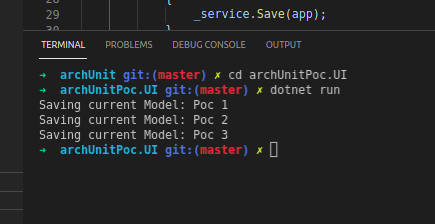

# archUnit
This project was created to validate an archUnit lib, some codes has archtecture problems.
I expecte create guarantees on solution architecture to be implemented and respected in all the project and fixes

For create this project I used the commands below:
```
# create solution
dotnet new sln --name archUnitPoc.sln 

# create projects
dotnet new classlib -n archUnitPoc.Repository
dotnet new classlib -n archUnitPoc.Domain  
dotnet new console -n archUnitPoc.UI 
dotnet new xunit -n archUnitPoc.Test 

# adding projects on solution
dotnet sln add archUnitPoc.Domain/archUnitPoc.Domain.csproj   
dotnet sln add archUnitPoc.Repository/archUnitPoc.Repository.csproj
dotnet sln add archUnitPoc.UI/archUnitPoc.UI.csproj
dotnet sln add archUnitPoc.Test/archUnitPoc.Test.csproj

# create references
dotnet add archUnitPoc.Repository/archUnitPoc.Repository.csproj reference archUnitPoc.Domain/archUnitPoc.Domain.csproj
dotnet add archUnitPoc.Test/archUnitPoc.Test.csproj reference archUnitPoc.Domain/archUnitPoc.Domain.csproj
dotnet add archUnitPoc.Test/archUnitPoc.Test.csproj reference archUnitPoc.Repository/archUnitPoc.Repository.csproj
dotnet add archUnitPoc.Test/archUnitPoc.Test.csproj reference archUnitPoc.UI/archUnitPoc.UI.csproj       
dotnet add archUnitPoc.UI/archUnitPoc.UI.csproj reference archUnitPoc.Domain/archUnitPoc.Domain.csproj        
dotnet add archUnitPoc.UI/archUnitPoc.UI.csproj reference archUnitPoc.Repository/archUnitPoc.Repository.csproj

# Install Packages
 # archUnitPoc.UI
 dotnet add package Microsoft.Extensions.DependencyInjection

 # archUnitPoc.Test
 I tried install ArchUnitNET.xUnit using documentation I had two problems:
  - The package name changed, I finded it with name: TngTech.ArchUnitNET.xUnit 
  - The package installed by cli on linux environment broke build, it was possible install by Nuget Manager on Windows environment
```
After create a project, I just create a simple classes for validate architecture rules.

Lets running the project, just check if it's ok
- open terminal
- navigate to project archUnit.UI
- execute command dotnet run

Do you'll see 3 logs, looks like this print:



Ok... the project works! 
Let's see the class Poc in archUnitPoc.UI -> Poc.cs


Observe on:

Line 2: There is a reference to repository layer, but, I don't want to UI layer access my repository layer

Line 17 and 18: Just explication the problems

Line 19 and 20: Creating repository object and using it to get data

Line 22: Just text for solution

Line 23: Solve problem the archecture test will show, dont forgot remove line 2, 17 to 20 too


...